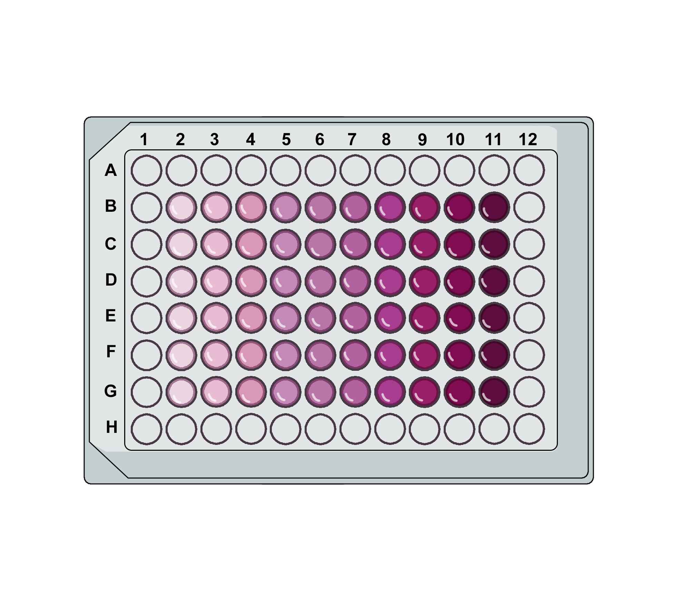
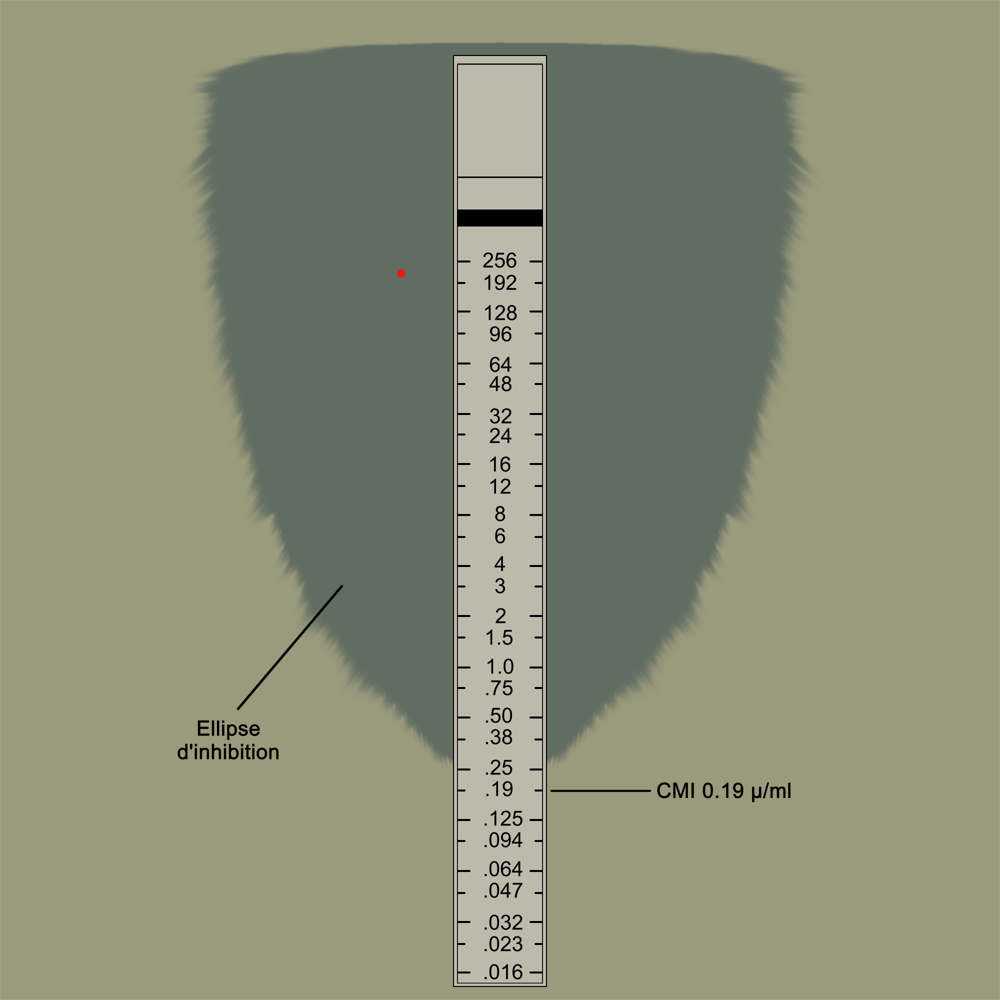

### Procedure :
 

#### Broth dilution method: 
This is the most common method used to determine MIC of an antibiotic. In this method, a broth is used for culturing bacteria. This broth contains all the required nutrients needed for the growth of bacteria. A series of test tubes or well- plate are first filled with equal volume of nutrient broth. After that different concentrations of antibiotic are added to the broth, with 1µg/ml representing the minimum concentration. Then a two-fold series is used, such as 1µg/ml, 2µg/ml, 4µg/ml, 8µg/ml, 16µg/ml and so on, until the highest value in the series is reached for the purpose of the test. Then, each tube or well is inoculated with a specific bacterial culture. The tubes or well-plate are incubated overnight at required temperature, generally 37 degrees Celsius. The tube or well-plate with the lowest concentration of the antibiotic to inhibit the growth of bacteria represents the MIC. 
 

 

#### Antimicrobial gradient method: 
This method uses E-strips which contains predefined gradient of antibiotic concentrations. First, with the help of a sterile swab spread the inoculum of bacterial culture onto the agar plate. Then, the strip is fixed to the agar plate with the help of sterile forceps ensuring that the length of the antibiotic gradient is in full contact with the agar surface petri plate. Incubate the plate for overnight. After incubation, the antibiotic gradient transfers to the agar to form a stable, continuous and exponential gradient of antibiotic concentrations below the strip. 
 

 

#### Disk diffusion test: 
This method consists of placing paper disks saturated with different concentration of antibiotics on a lawn of bacteria seeded on the agar surface, incubating the plate overnight and measuring the presence of a zone of inhibition around the disks. The minimum zone of inhibition with the lowest concentration of the antibiotic to inhibit the growth of bacteria represents the MIC. 
 

