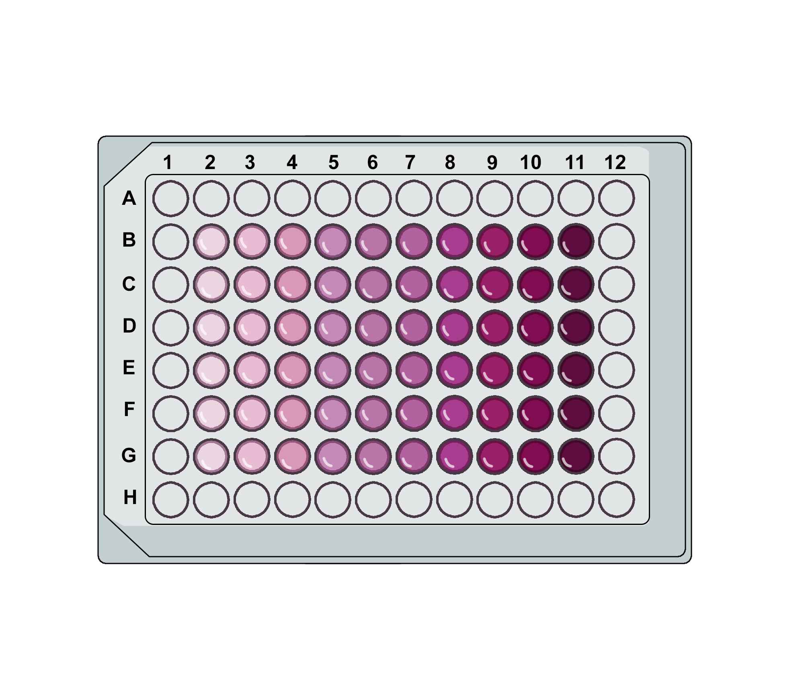
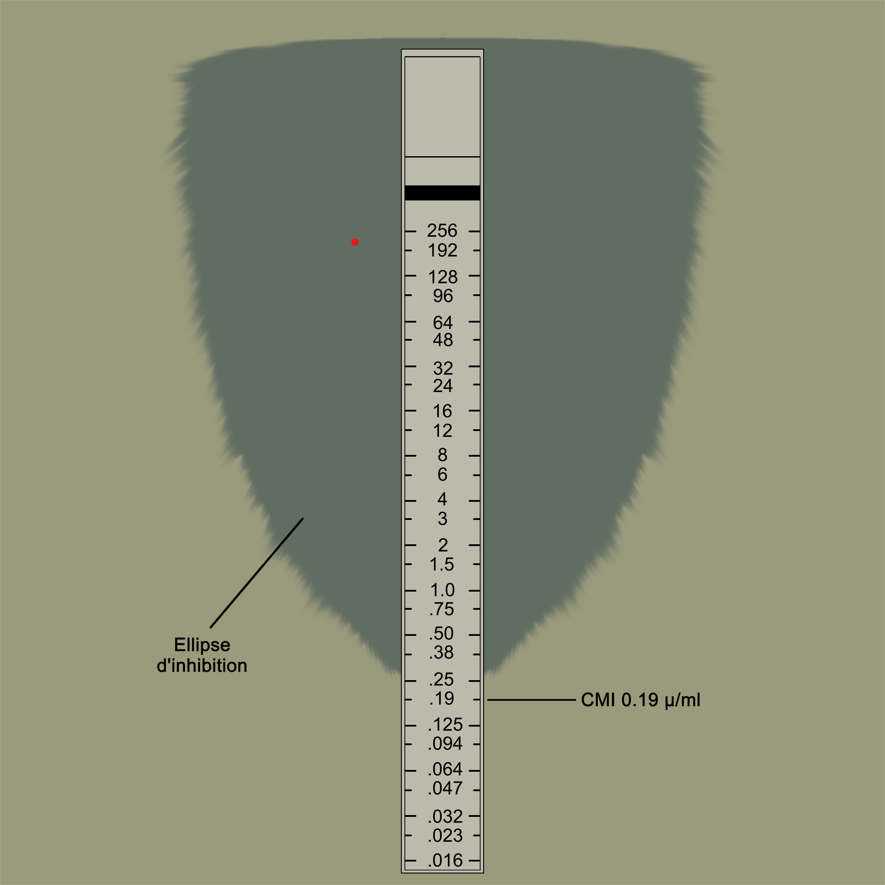
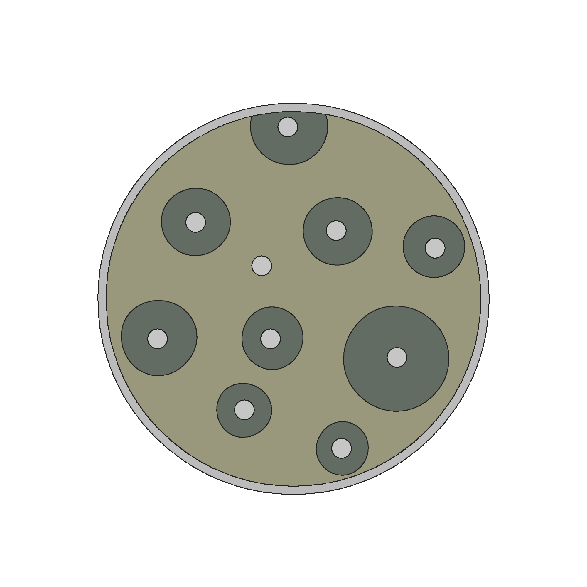

### Procedure :
 

#### 1. Broth dilution method: 
This is one of the most commonly used methods for determining MIC. It involves preparing a series of test tubes or wells containing nutrient broth with increasing concentrations of an antibiotic. After inoculation with bacteria and incubation, the MIC is determined by observing the lowest concentration at which bacterial growth is inhibited. 
<ol>
  <li>Prepare a series of test tubes or wells, each containing an equal volume of nutrient broth.</li>
  <li>Add different concentrations of the antibiotic in a two-fold dilution series (e.g., 1 µg/ml, 2 µg/ml, 4 µg/ml, etc.).</li>
  <li>Inoculate each tube or well with the bacterial culture.</li>
  <li>Incubate the tubes or well plate overnight at 37°C.</li>
  <li>Observe bacterial growth by checking for turbidity.</li>
  <li>Identify the lowest concentration of the antibiotic that completely inhibits bacterial growth this represents the MIC.</li>
</ol>
 

 

#### 2. Antimicrobial gradient method: 
This method uses E-strips, which contain a predefined gradient of antibiotic concentrations. When placed on an inoculated agar plate, the antibiotic diffuses into the medium, creating a gradient. After incubation, the MIC is determined by identifying the point at which bacterial growth is inhibited along the strip.
<ol>
  <li>Prepare an agar plate and evenly spread the bacterial inoculum using a sterile swab.</li>
  <li>Place the E-strip onto the agar surface using sterile forceps, ensuring full contact.</li>
  <li>Incubate the plate overnight at 37°C.</li>
  <li>Observe the antibiotic gradient diffused into the agar.</li>
  <li>Identify the point along the strip where bacterial growth is inhibited this represents the MIC.</li>
</ol>
 
 

 

#### 3. Disk diffusion test: 
In this method, paper disks impregnated with different concentrations of antibiotics are placed on an agar plate inoculated with bacteria. During incubation, the antibiotic diffuses into the surrounding medium, forming a zone of inhibition where bacterial growth is prevented. The MIC is determined by measuring the smallest inhibition zone corresponding to the lowest antibiotic concentration. 
<ol>
  <li>Prepare an agar plate and evenly spread the bacterial culture using a sterile swab.</li>
  <li>Place antibiotic-impregnated paper disks on the agar surface.</li>
  <li>Incubate the plate overnight at 37°C.</li>
  <li>After incubation, observe the zone of inhibition around each disk.</li>
  <li>Measure the diameter of the inhibition zone.</li>
  <li>Determine the lowest antibiotic concentration that produces a zone of inhibition representing the MIC.</li>
</ol>
 

  

  

  <figure class="video_container" style="width: 600px; height: 350px;">
    <iframe style="width: 100%; height: 100%;" src="https://www.youtube.com/embed/videoseries?si=zn3jqezpHpEMxVYa&amp;list=PLTkVi3dAX_-9WMgo5mLU6QSHLSCG3kwvV" title="YouTube video player" frameborder="0" allow="accelerometer; autoplay; clipboard-write; encrypted-media; gyroscope; picture-in-picture; web-share" referrerpolicy="strict-origin-when-cross-origin" allowfullscreen></iframe>
  </figure>

